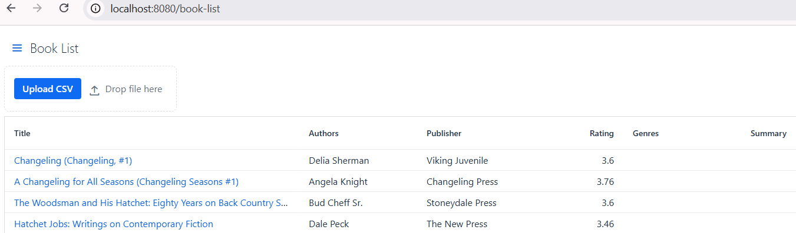

# Building a Smarter Book Inventory using Vaadin and Spring AI


Hey everyone! I'm excited to share a simple yet powerful project: a smarter website for managing book collections.

In this post, we're going to build this web application from the ground up. We will use Spring Boot, Spring AI, [Vaadin Flow](https://vaadin.com/docs/latest/flow/what-is-flow) to create it. And we will store the data in the cloud using GridDB Cloud.

## Core Features

So, what exactly are we building? Let's break it down.

1. Importing Books from CSV

    A common and easy way to get a list of existing books is often from a CSV file. Think of a simple spreadsheet with columns like `Title` and `Author`.
    We will build a small part of the application to read this CSV file. This `parser` will read lines, split them by commas, and create `Book` object with `title`, `authors`, `publisher`, and `rating`. This will serve as our initial dataset in the database. It's the first step before adding more exciting features.

2. AI Enrichment

    Once we have the initial dataset, we'll take each book record and look up it's genre and a brief summary. We'll use Spring AI to send request to the Open AI API. Then, we'll read the response, extract the genre and summary, and update the book data.

Based on the above features we need the following components:

- A web interface for listing books, upload the CSV, and book detail page where user ask the AI to update book's genre and summary by clicking a button. We will develop this UI using Vaadin Flow.

- CSV parser component

- An AI Enrichment Service that uses Spring AI to interact with LLM model.

- A NoSQL Database Service to interact with GridDB Cloud API. We will use Spring `RestClient` to handle the `request` and `response`. This will also convert Java `record` into `HTTP` body according to the API specifications.

## Tech Stack

For this project, I selected:

- [Spring Boot](https://spring.io/projects/spring-boot)

    Spring Boot streamlines development with auto-configuration, an embedded server, and starter dependencies. This effortless setup accelerates our ability to build and launch applications swiftly.

- [Vaadin Flow](https://vaadin.com/docs/latest/flow/what-is-flow)

    Vaadin Flow serves as a versatile Java UI framework, allowing us to construct web applications purely in Java. This approach simplifies our process by minimizing the hassle of juggling separate frontends. Packed with a treasure trove of pre-built components, Vaadin is tailor-made for data-rich business applications, ensuring users enjoy a seamless experience.

- [Spring AI](https://spring.io/projects/spring-ai)

    Spring AI is a powerful extension of the [Spring Framework](https://spring.io/projects/spring-framework). It empowers Java developers to craft AI-driven applications with minimal reskilling required. By tapping into the strengths of the Spring Framework, Spring AI opens the door to advanced AI features, simplifying the journey to creating intelligent apps.

## Create a new Vaadin Project

To create a Vaadin Flow project, go to [start.vaadin.com](https://start.vaadin.com/app). This starter project has a basic application with a fully-functional end-to-end workflow. Choose a pure Java option with Vaadin Flow. Click the download button, then unzip and open the project into your favorite IDE.

You should now see a typical Maven project as shown below:

```sh
├───.mvn
├── mvnw
├── mvnw.cmd
├── pom.xml
├── README.md
├───src
│   ├───main
│   │   ├───frontend
│   │   ├───java
│   │   └───resources
│   └───test
│       ├───java
│       └───resources
```

## Data Access

Next, we need a domain object to hold the Book data as follow:

```java
public record Book(String id, String title, String authors, String publisher, Double rating, String genres,
        String summary, Long goodreadsBookId, String goodreadsUrl) {
    public Book(String id, String title, String authors, String publisher, Double rating, String genres, String summary,
            Long goodreadsBookId) {
        this(id, title, authors, publisher, rating, genres, summary, goodreadsBookId, null);
    }
}
```

Next, we create a `BookService.java` class to fetch and store data. Also to pass data to the presentation layer.

```java
@Service
public class BookService {
    private final BookContainer bookContainer;

    public BookService(BookContainer bookContainer) {
        this.bookContainer = bookContainer;
    }

    public List<Book> listBooks() {
        return this.bookContainer.getBooks();
    }

    public Book getBook(String id) {
        Book book = this.bookContainer.getBook(id);
        if (book == null) {
            throw new IllegalArgumentException("Book with ID " + id + " does not exist.");
        }
        return book;
    }

    public void createTableBooks() {
        this.bookContainer.createTableBooks();
    }

    public void saveBooks(List<Book> books) {
        if (books == null || books.isEmpty()) {
            return;
        }
        List<Book> newBooks = books.stream().map(book -> {
            String id = (book.id() != null) ? book.id() : nextId();
            return new Book(id, book.title(), book.authors(), book.publisher(), book.rating(), book.genres(),
                    book.summary(), book.goodreadsBookId(), book.goodreadsUrl());
        }).collect(Collectors.toList());
        this.bookContainer.saveBooks(newBooks);
    }

    public static String nextId() {
        return "book_" + TsidCreator.getTsid().format("%S");
    }
}
```

- The `saveBooks()` method accept a list of books. Both creating a new book and updating a book will use this method.
- We generate the book's ID using [Time-Sorted Unique Identifiers (TSID)](http://github.com/f4b6a3/tsid-creator).

Next, we create the `BookContainer.java` to interact with the database API:

```java
@Service
public class BookContainer {
    private final GridDbCloudClient gridDbCloudClient;
    private static final String BOOKS_TBL_NAME = "Books";
    public BookContainer(GridDbCloudClient gridDbCloudClient) {
        this.gridDbCloudClient = gridDbCloudClient;
    }
    public void createTableBooks() {
        List<GridDbColumn> columns = List.of(new GridDbColumn("id", "STRING", Set.of("TREE")),
                new GridDbColumn("title", "STRING"), new GridDbColumn("authors", "STRING"),
                new GridDbColumn("publisher", "STRING"), new GridDbColumn("rating", "DOUBLE"),
                new GridDbColumn("genres", "STRING"), new GridDbColumn("summary", "STRING"),
                new GridDbColumn("goodreadsBookId", "LONG"), new GridDbColumn("goodreadsUrl", "STRING"));

        GridDbContainerDefinition containerDefinition = GridDbContainerDefinition.createContainer(BOOKS_TBL_NAME,
                columns);
        this.gridDbCloudClient.createContainer(containerDefinition);
    }
}
```

- `GridDbCloudClient`: to communicate with the GridDB Cloud database. Provided automatically by Spring Boot through constructor-based dependency injection. 
- `BOOKS_TBL_NAME`: table name as a constant.
- `createTableBooks()`: create a `Books` table (`collection`) in GridDB Cloud database to hold records for our books. This method started by creating a `List` of `GridDBColumn` objects. Each object describes one column with data type. Then create the container definition and use the `GridDbCloudClient` to actually create the table.

```java
//BookContainer.java
    public void saveBooks(List<Book> books) {
        StringBuilder sb = new StringBuilder();
        sb.append("[");
        for (int i = 0; i < books.size(); i++) {
            Book book = books.get(i);
            sb.append("[");
            sb.append("\"").append(book.id()).append("\"");
            sb.append(", ");
            sb.append("\"").append(book.title()).append("\"");
            sb.append(", ");
            sb.append("\"").append(book.authors()).append("\"");
            sb.append(", ");
            sb.append("\"").append(book.publisher()).append("\"");
            sb.append(", ");
            sb.append(book.rating());
            sb.append(", ");
            sb.append("\"").append(book.genres() != null ? book.genres() : "").append("\"");
            sb.append(", ");
            sb.append("\"").append(book.summary() != null ? book.summary() : "").append("\"");
            sb.append(", ");
            sb.append(book.goodreadsBookId());
            sb.append(", ");
            sb.append("\"").append(book.goodreadsUrl() != null ? book.goodreadsUrl() : "").append("\"");
            sb.append("]");
            if (i < books.size() - 1) {
                sb.append(", ");
            }
        }
        sb.append("]");
        String result = sb.toString();
        this.gridDbCloudClient.registerRows(BOOKS_TBL_NAME, result);
    }
```

- `saveBooks(List<Book> books)`: designed to receieve a List of Book objects and save them into the `Book` collection created earlier. First, format the list into a specialized string representation of an array of arrays, and then uses the GridDB client to send this formatted string to save all the book records in the database.

An illustration of the request body used to register rows into a container:
```json
[
    ["abf8e412", "The Ultimate Hitchhiker's Guide to the Galaxy", "Douglas Adams", "Del Rey Books", 4.37, "", "", 13],
    ["5f8bdef1", "The Lost Continent: Travels in Small Town America", "Bill Bryson", "William Morrow Paperbacks", 3.83, "", "", 26]
]
```

Getting books from GridDB Cloud Cloud.

```java
//BookContainer.java
    public List<Book> getBooks() {
        AcquireRowsRequest requestBody = AcquireRowsRequest.builder().limit(50L).build();
        AcquireRowsResponse response = this.gridDbCloudClient.acquireRows(BOOKS_TBL_NAME, requestBody);
        if (response == null || response.getRows() == null) {
            return List.of();
        }
        List<Book> books = convertResponseToBook(response);
        return books;
    }
```

- Build the Request body by creating a `AcquireRowsRequest` object, tells GridDB how many rows I want to get.
- Use the `gridDbCloudClient.acquireRows(BOOKS_TBL_NAME, requestBody)` to send request to the API.
- Check if the response is null or if there are no rows in the response.
- If everything is okay, convert the database response into a list of `Book` object and return it.

Converting raw data to `Book` objects.

```java
//BookContainer.java
    private List<Book> convertResponseToBook(AcquireRowsResponse response) {
        List<Book> books = response.getRows().stream().map(row -> {
            try {
                var book = new Book(row.get(0).toString(), row.get(1).toString(), row.get(2).toString(),
                        row.get(3).toString(),
                        Optional.ofNullable(row.get(4)).map(Object::toString).map(Double::valueOf).orElse(null),
                        Optional.ofNullable(row.get(5)).map(Object::toString).orElse(null),
                        Optional.ofNullable(row.get(6)).map(Object::toString).orElse(null),
                        Optional.ofNullable(row.get(7)).map(Object::toString).map(Long::valueOf).orElse(null),
                        Optional.ofNullable(row.get(8)).map(Object::toString).orElse(null));
                return book;
            } catch (Exception e) {
                return null;
            }
        }).filter(book -> book != null).toList();
        return books;
    }
```

- Using Java Streams to process each row from the database.
- For each row, create a new `Book` object. The database returns data as a list where each position represents a different field.
- Check for null values and handle errors gracefully.


## CSV Parser for Goodreads Book

In this project we are going to use [Goodreads book dataset](https://www.kaggle.com/datasets/bahramjannesarr/goodreads-book-datasets-10m). Goodreads is the world's largest site for readers and book recommendations.

The book sample in CSV:

```csv
Id,Name,RatingDist1,pagesNumber,RatingDist4,RatingDistTotal,PublishMonth,PublishDay,Publisher,CountsOfReview,PublishYear,Language,Authors,Rating,RatingDist2,RatingDist5,ISBN,RatingDist3
1339,"Loving and Dying: A Reading of Plato's Phaedo, Symposium, and Phaedrus",1:0,288,4:2,total:5,12,11,University Press of America,0,2001,,Richard Gotshalk,4.6,2:0,5:3,0761820728,3:0
```

Why creating a custom Parser?
> Because this CSV data contain commas within the actual data.


```java
//GoodReadBookCSVParser.java
try (BufferedReader reader = new BufferedReader(new InputStreamReader(is, StandardCharsets.UTF_8))) {
    String line;
    boolean isFirst = true;
    while ((line = reader.readLine()) != null) {
        if (isFirst) {
            isFirst = false;
            continue;
        }
        String[] fields = parseCsvLine(line);
        //assign parser result into each field
        Book book = new Book(null, title, authors, publisher, rating, null, null, goodreadsBookId);
        books.add(book);
    }
}
```

- The parser receive `InputStream` and wrap it into `BufferedReader`, buffering characters to efficiently read characters, arrays, and lines. We use a `Try-with-resource` block to ensure the File resource gets closed properly, even if something goes wrong. Also specify UTF-8 encoding to handle special characters correctly.


```java
//GoodReadBookCSVParser.java
private String[] parseCsvLine(String line) {
    List<String> result = new ArrayList<>();
    boolean inQuotes = false;
    StringBuilder sb = new StringBuilder();
    for (int i = 0; i < line.length(); i++) {
        char c = line.charAt(i);
        if (c == '"') {
            inQuotes = !inQuotes;
        } else if (c == ',' && !inQuotes) {
            result.add(sb.toString());
            sb.setLength(0);
        } else {
            sb.append(c);
        }
    }
    result.add(sb.toString());
    return result.toArray(new String[0]);
}
```

- `parseCsvLine()`: goes through each character one by one. Tracking whether currently inside a quoted field. When there is a comma, only treat it as a field separator if NOT inside quotes.

## Creating Vaadin views and layouts

Because this project was generated using [Vaadin Start](https://start.vaadin.com/), we got a fully functional application that can be easily extended and customized. So, we will add new view by following the existing structure.

```sh
com.company
├───base
│   └───ui
│       ├───component
│       └───view
└───bookinventory
    ├───domain
    ├───seeder
    ├───service
    └───ui
        └───view
                BookDetailView.java
                BookListView.java
```

Now, let's add `BookListView` component to display all books.

```java
//BookListView.java
@Route("book-list")
@PageTitle("Book List")
@Menu(order = 0, icon = "vaadin:book", title = "Book List")
public class BookListView extends Main {
    private final Logger log = LoggerFactory.getLogger(getClass());
    private final BookService bookService;
    private final Grid<Book> bookGrid;
}
```

- `@Route("book-list")` : defined a Flow view that can be accessed at `htt://localhost:8080/book-list`.
- `@Menu`: make a Flow view appear in the menu.
- Use `BookService` to get list of books and to save uploaded books from CSV
- Vaadin `Grid` to display tabular data of books.
- A component for uploading a CSV file as shown at [BookListView.java](https://github.com/alifruliarso/book-inventory-withspringai/blob/362d98f7f7dec7a94f34684115916d4ea8f0e99a/src/main/java/com/galapea/techblog/bookinventory/ui/view/BookListView.java#L106)



Next, adding `BookDetailView`. From the book list, we click one of the book titles, then navigate to the book detail.

```java
@Route("book-detail")
@PageTitle("Book Detail")
public class BookDetailView extends VerticalLayout implements HasUrlParameter<String> {
    private final BookService bookService;
    private FormLayout content;
    private String bookId;

    private Button fetchGenreBtn;
    private ProgressBar progressBar;
    private NativeLabel progresLabel;
    private Button fetchSummaryBtn;

    public BookDetailView(BookService bookService) {
        this.bookService = bookService;
        fetchGenreBtn.addClickListener(e -> {
            var ui = UI.getCurrent();
            Book book = getCurrentBook();
            progresLabel.setVisible(true);
            progresLabel.setText("Asking AI for " + book.title() + "...");
            progressBar.setVisible(true);
            progressBar.setIndeterminate(true);
            bookService.asyncGenerateGenre(book.id(), ui.accessLater(this::onJobCompleted, null),
                    ui.accessLater(progressBar::setValue, null), ui.accessLater(this::onJobFailed, null));
        });
    }
}
```

- Extends `VerticalLayout`, so all components added will be shown vertically.
- Implements `HasUrlParameter<String>`, so the page can receive a book ID from the URL.
- We use `BookService` to fetch the book from database, call the  AI assistant, and update the book data.
- The `content` form layout will show book details.
- When the `fetchGenreBtn` button clicked, we show a progress bar while the `bookService` starting the AI task.


## Spring AI Integration

Our book data is ready in the database and we can access it through the listing and details page. Now it is time to enhance the functionality by integrating AI. We're going to dive into how we can use AI to automatically figure out the genre and write a concise summary for each book.

Before we dive into the "how", let's talk about an important part: **Large Language Models (LLM)**. These are powerful AI systems (like OpenAI's GPT models) that can understand and create human-like text. They let us "ask" for a book's genre or summary.

Now, we need to connect to these AI models. This is where **Spring AI** comes in as our best friend. Spring AI simplifies how we work with LLMs. We don't have to send raw HTTP requests to OpenaI. Spring AI handles all that heavy lifting. It provides a consistent way to interact with different LLM provider. So, whether we're using OpenAI today or decide to switch to Google Gemini tomorrow, our code for making AI calls remains largerly the same.

Include Spring AI dependency in our `pom.xml`:

```xml
    <properties>
        <spring-ai.version>1.0.0-SNAPSHOT</spring-ai.version>
    </properties>
    <dependency>
        <groupId>org.springframework.ai</groupId>
        <artifactId>spring-ai-starter-model-openai</artifactId>
        <version>${spring-ai.version}</version>
    </dependency>
```

Configure API Key:

```properties
# The OpenAI API key to use
spring.ai.openai.api-key=${OPENAI_API_KEY}
# The default OpenAI model to use
spring.ai.openai.model=${OPENAI_MODEL: gpt-4o-mini}
```

Configure `ChatClient`:

```java
@Configuration
public class ChatClientConfig {
    @Bean
    public ChatClient chatClient(ChatClient.Builder chatClientBuilder) {
        return chatClientBuilder.build();
    }
}
```

Create a `BookAssistant.java` for sending book data into LLM and return the response. This class called by `BookService`.

```java
    public BookAIReply findBookGenre(String title, String authors) {
        BookAIReply reply = chatClient.prompt()
                .user(user -> user.text("What is the genre of the book {title} by {authors}. Provide the source url.")
                        .param("title", title).param("authors", authors))
                .call().entity(BookAIReply.class);
        return reply;
    }

    public BookAIReply findBookSummary(String title, String authors) {
        BookAIReply reply = chatClient.prompt()
                .user(user -> user.text("What is the summary of the book {title} by {authors}. Provide the source url.")
                        .param("title", title).param("authors", authors))
                .call().entity(BookAIReply.class);
        return reply;
    }
```

- We use zero-shot prompting techniques. The zero-shot prompt directly instructs the model to perform a task without any additional examples to steer it.

- **`chatClient.prompt()`**  
   Starts building a prompt for the AI model.

- **`.user(user -> user.text(...).param(...))`**  
   - Defines the user message for the prompt.
   - User Role: Represents the user’s input – their questions, commands, or statements to the AI.
   - `user.text(...)` sets the message template, using placeholders (`{title}`, `{authors}`).
   - `.param("title", title)` and `.param("authors", authors)` inject the actual values into the template.

- **`.call()`**
   Executes the prompt, sending it to the AI model.

- **`.entity(BookAIReply.class)`**  
   Maps the AI’s response to a `BookAIReply` Java object, making it easy to work with structured data.

- This method chain provides a fluent, type-safe way to interact with AI models using Spring AI, abstracting away the complexity of prompt construction and response parsing. The same pattern is used for other methods.

And finally wire in the `BookAssistant` component into the `BookService`. 

```java
BookAIReply reply = bookAssistant.findBookSummary(book.title(), book.authors());
String summary = reply.value();
String sourceUrl = reply.sourceUrl();
```

You can find the code for this article on [Github](https://github.com/alifruliarso/book-inventory-withspringai/tree/main) and run the application from the command line with Maven.


## Summary

In this article, we have built a web application without touching a single line of JavaScript or HTML. We achieved this by combining Vaadin with Spring Boot. What's more, we make it even smarter by integrating Spring AI, giving it intelligent capabilities.

Future enhancements:

- Adding data filtering
- Use pagination or lazy loading.
- Evaluate generative AI output.
- Enable natural language queries for book searches with semantic search.
- Add a voice assistant that responds to user commands.
